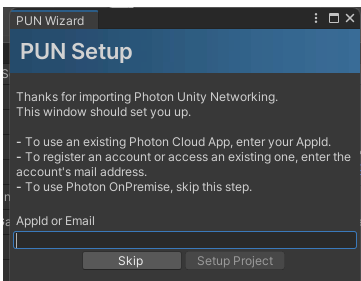
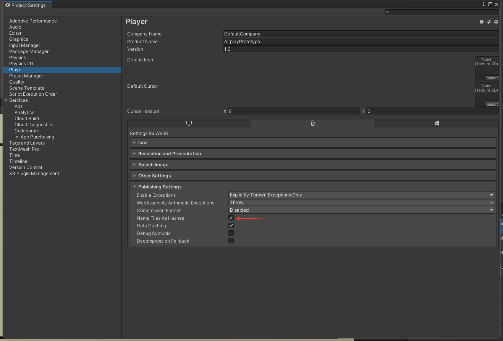

# Game Dev for Air Play

## 1. Introduction

This repo is a collection of several AR game prototypes. The games are structured as subgroups in each folder

1. Air Hockey (AirHockey)
2. 

## 2. Structure and Naming Convention

Packages like Photon, ROS Integration should be installed in `Packages`

In `Resources`,`Scripts`,`Scenes`, for each game, create a subfolder named with the game like `AirHockey` for Air Hockey Game

## 3. PUN Installation

1. Clone the project into local
2. Download the [PUN 2 Package](https://assetstore.unity.com/packages/tools/network/pun-2-free-119922) from Unity Assets Store. 
3. Using Unity Package Manager (Window->Package Manager). Import the package into the project
4. You will be prompted an interface below. Enter your email here if you have never registered at https://dashboard.photonengine.com/. Else, enter the AppId. To get the AppId, visit https://dashboard.photonengine.com/, go into your dashboard and find the APP ID for your PUN application.

## 4. Build Settings 

### WebGL

Make sure this option is checked before WebGL building

